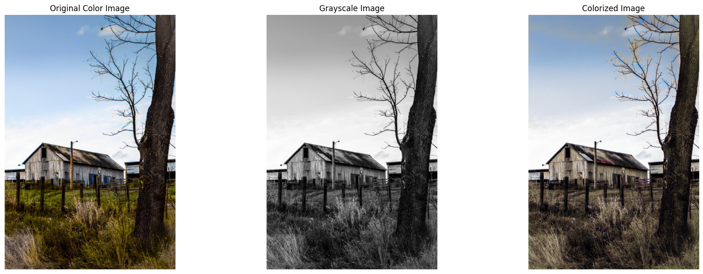

# Gen AI Image Colorization Model

This project presents an AI model for **colorizing grayscale images** using a deep learning-based architecture. The model was trained on the **CIFAR-10** dataset, which contains 60,000 color images categorized into 10 classes. The model uses a **Convolutional Neural Network (CNN)** to predict and generate colorized versions of grayscale images, transforming them into realistic, colorful images. This model has applications in restoring old black-and-white images, enhancing photographs, and other creative tasks powered by AI.

## Project Overview

This project uses the **CIFAR-10 dataset**, which contains 60,000 color images of size 32x32 in 10 classes. The model takes grayscale images as input and generates colorized outputs. The model is based on a **Convolutional Neural Network (CNN)** and uses a custom architecture designed for image colorization tasks.

Access the [Colab NoteBook](https://colab.research.google.com/drive/1fzz1zf7SfSYYHTCUsOpMYJ_GMDjdMEOJ?usp=sharing) here.

The project provides:
- Model training on the CIFAR-10 dataset.
- A pre-trained model for colorizing grayscale images.
- A simple interface for inference to generate colorized images. (Google Colab)

## Features

- **Colorization:** Automatically colorizes grayscale images.
- **Deep Learning Model:** Built using PyTorch and designed for image colorization.
- **Training and Inference:** Train your own model or use the pre-trained one for inference on grayscale images.
- **Exaggerated Colors Enhancement:** For better colorization output, we have implemented an `exaggerated_colors` function. This function works by converting the generated RGB image to the **HSV (Hue, Saturation, Value)** color space, adjusting the saturation for more vivid colors, and then converting the image back to **RGB**. This process helps produce more vibrant and visually appealing colorization results.

## Model Architecture

The model, `ColorizationNet`, consists of the following layers:

```python
class ColorizationNet(nn.Module):
    def __init__(self):
        super(ColorizationNet, self).__init__()
        self.conv1 = nn.Conv2d(1, 64, kernel_size=5, stride=1, padding=4, dilation=2)
        self.conv2 = nn.Conv2d(64, 64, kernel_size=5, stride=1, padding=4, dilation=2)
        self.conv3 = nn.Conv2d(64, 128, kernel_size=5, stride=1, padding=4, dilation=2)
        self.conv4 = nn.Conv2d(128, 3, kernel_size=5, stride=1, padding=4, dilation=2)

    def forward(self, x):
        x = nn.functional.relu(self.conv1(x))
        x = nn.functional.relu(self.conv2(x))
        x = nn.functional.relu(self.conv3(x))
        x = torch.sigmoid(self.conv4(x))
        return x
```

### Layers:
1. **Convolutional Layers:** The network applies multiple convolutional layers to capture spatial features in the image.
2. **ReLU Activation:** After each convolution, a ReLU activation introduces non-linearity to the model.
3. **Final Output Layer:** The final output is an RGB image generated by the model using a sigmoid activation, scaled to the [0, 1] range.

## Training the Model

### Dataset: CIFAR-10
The model was trained on the **CIFAR-10 dataset**, which consists of 60,000 images in 10 categories, including animals and objects. The images in CIFAR-10 are 32x32 pixels in size and contain 3 color channels (RGB). During training, the images are converted to grayscale to simulate real-world use cases where we start with black-and-white images.

### Prepare the CIFAR-10 Dataset:
To download and prepare the CIFAR-10 dataset, you can use the following PyTorch utility:

```python
import torchvision
import torchvision.transforms as transforms

transform = transforms.Compose([transforms.Grayscale(num_output_channels=1), transforms.ToTensor()])
trainset = torchvision.datasets.CIFAR10(root='./data', train=True, download=True, transform=transform)
testset = torchvision.datasets.CIFAR10(root='./data', train=False, download=True, transform=transform)
```

### Run Training:
1. **Prepare your dataset**: Ensure you have CIFAR-10 downloaded.
2. **Run the training codeblock:**

```python
EPOCHS = 30
for epoch in range(EPOCHS):
    for i, (images, _) in enumerate(train_loader):
        grayscale_images = rgb_to_gray(images).to(device)
        images = images.to(device)

        # Forward pass

        outputs = model(grayscale_images)
        loss = criterion(outputs, images)

        # Backward pass and optimize
        optimizer.zero_grad()
        loss.backward()
        optimizer.step()

        # Print statistics
        if i % 100 == 0:
            print(f"Epoch [{epoch+1}/{EPOCHS}], Step [{i+1}/{len(train_loader)}], Loss: {loss.item():.4f}")

print("Finished Training")
```

**Arguments:**
- `train_loader` is responsible for feeding the training data to the model in batches.
- `enumerate` provides a counter (i) for each batch.
- `images` contains the batch of color images.
- `_` is used as a placeholder for the labels (which are not needed for this unsupervised colorization task).

### Example Output:
Above is an example of what the model can produce when given a grayscale input image from CIFAR-10:

## Requirements

To run this code, you'll need Python 3.8+ and the following dependencies:

- Python 3.8+
- PyTorch
- NumPy
- OpenCV
- Matplotlib
- tqdm

## Acknowledgements

- **Deep Learning Libraries:** This project uses PyTorch for deep learning.
- **CIFAR-10 Dataset:** The CIFAR-10 dataset is publicly available and was used for training.
- **Inspiration:** The project is inspired by research on image colorization using deep learning techniques.

---
Made with 💖 by Satvik